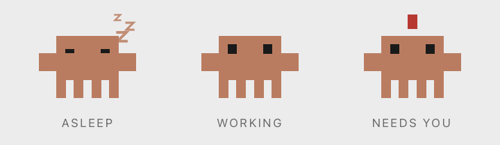
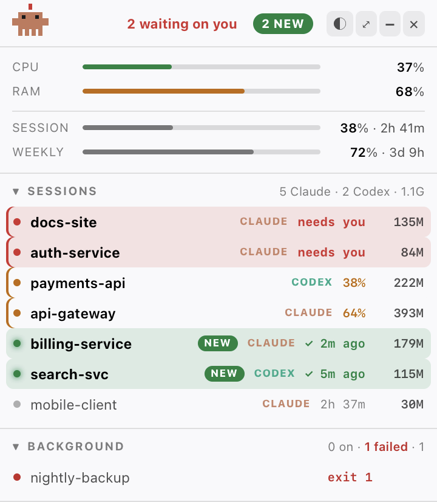
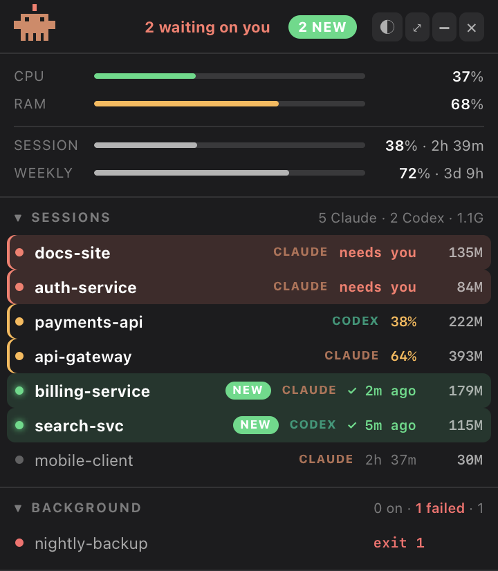
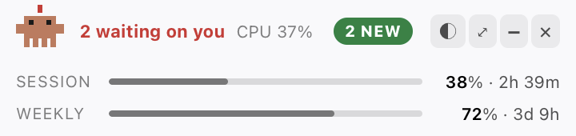

# David Claude HUD

**A little guy who sits on top of everything and tells you which of your agents
needs you.**



## The problem this exists to solve

I run a lot of coding agents at once — ten, twelve terminal windows, each one
working on something different.

Here's what kept happening. An agent finishes. A sound plays. I'm deep in
another window, so I don't look up. And even when I do, the sound doesn't tell
me *which* of the twelve just finished — and hunting through a dozen
near-identical terminal tabs to find out costs more attention than the
interruption is worth. So I don't. I tell myself I'll check later.

I don't check later.

Hours pass. Sometimes a day. And when I finally go looking, I find a session
that finished ages ago, sitting there — work done, waiting on one review, one
answer, one "yes, continue" — and the project just **stopped**. Not because the
agent failed. Because I forgot it existed.

The worse ones are those that stopped *mid-task* to ask permission. Those aren't
finished-and-forgotten, they're frozen. An agent that needed ten seconds of my
attention sat idle for six hours instead.

This tool is for exactly that. It doesn't make agents faster. It makes it
impossible to forget one.

## How it fixes it

**Nothing that finished is allowed to go quiet.** A finished session gets a
green `NEW` tag that **stays** — not for 30 seconds, not until the next event.
It sorts itself to the top of the list, and the count rides on the menu-bar icon
(`◧3`) even when the panel is hidden. The only thing that clears it is you
actually going and looking. That's the entire point.

**Double-click the row, land in the right terminal.** No hunting. The window
comes forward with the correct tab already selected.

**Anything blocked on you shouts.** A session waiting for permission jumps to
the top in **red** reading `needs you`, the panel un-minimises itself, pulses,
and plays a sound. You can't scroll past it. Not actually urgent? Hover it and
hit `↓` to push it back down — the character stops waving and the title bar
stops shouting. If that session asks again later, it comes straight back up.

The three states never share a colour, so the list reads at a glance:

| | | |
|---|---|---|
| 🔴 red | `needs you` | you are the blocker |
| 🟠 amber | working | still cooking, leave it |
| 🟢 green | `✓ done` | finished, go and look |

**Double-click a row** to jump to its terminal — and while your pointer is over
the list, nothing re-orders under it. A single click used to jump *and* re-rank
the row out from under the cursor, so the second half of a double click landed
on whatever had slid into that spot.

## The little guy

He lives in the title bar, and you read him without reading anything.

**😴 Asleep** — nothing is running. Eyes shut, slow deep breathing, a slight
droop, and three `z`s drifting up off his head. Everything's quiet; go get a
coffee.

**🕺 Dancing** — at least one agent is working. He bobs and tilts side to side
with his arms flapping. Quicker than reading a CPU number: if he's dancing,
something is still cooking.

**👋 Waving** — something needs you. He hops on the spot waving an arm, with a
red `!` flashing over his head, and he doesn't stop until you deal with it.

He ends up being the fastest status check in the whole thing. Most of the time
you never open the panel — you just notice out of the corner of your eye that
he's stopped dancing, or started waving.

## Everything else it shows



**Sessions** — every live agent: name, state, how long it's been that way, live
CPU, and the memory of its **whole process tree** (the CLI plus its
node/python/MCP children, which is where the memory actually goes).

**Your usage limits** — the Claude 5-hour session window and the weekly one,
with time until each resets. Hover the weekly bar for the per-model scoped
limit, usually the one that bites first. No more finding out you're out of
runway halfway through something.

**Machine load** — CPU and RAM, measured properly. (RAM uses Activity Monitor's
definition rather than counting the file cache, which would read ~99% forever
and tell you nothing.)

**Background jobs** — every launchd agent and crontab entry: running ones green,
failed ones red with their exit code, scheduled ones with time until next run.
Switching this on for the first time usually turns up a couple of cron jobs that
have been quietly failing for weeks.

<p align="center">
  
  
</p>

Minimised it's one line — but it keeps the two limit bars, because those are the
ones worth a glance while you work.

## Works with any agent, not just Claude

Session discovery is one rule: **an agent process that owns a terminal.** That
alone gives memory, live CPU, uptime, click-to-jump and a name from the working
directory — for anything. Busy/idle is inferred from real CPU usage (an agent
parked at a prompt sits near zero; one streaming or running tools does not),
with hysteresis so a pause between tool calls doesn't read as "finished".

Built in: Claude Code, Codex, Gemini, Aider, opencode, Amp, Cursor, Crush. When
more than one kind is running each row is tagged; with only one, the tags
disappear.

Agents that publish more get more. Claude Code publishes exact per-session
state, so its rows use that instead of the heuristic, and it's the one that can
show usage limits and a true waiting-for-you signal.

| | state | usage limits | waiting-for-you |
|---|---|---|---|
| Claude Code | exact | ✅ | ✅ (`Notification` hook) |
| everything else | inferred from CPU | — | — |

Add your own in `~/.claude-hud/providers.json`:

```json
[
  { "id": "mycli", "label": "MyCLI", "match": ["mycli"], "colour": "#ff8800" }
]
```

- `match` — executable basenames (a login shell's leading `-` is handled).
- `cmdline` — optional regex against the full command, for CLIs that run as
  `node .../cli.js` and whose executable name is just `node`.
- `logs` — optional glob of transcript files; a recent write also counts as
  "working", which is more responsive than CPU alone.

Reusing a built-in `id` overrides it, so a match rule or colour can be retuned
without touching the source.

## Install

macOS 12+ and the Xcode Command Line Tools (`xcode-select --install`).

```sh
git clone https://github.com/davidnietzsche/david-claude-hud.git
cd david-claude-hud
./install.sh
```

That compiles the app, registers a LaunchAgent so it starts at login, and adds
the attention hooks to `~/.claude/settings.json` — appending only, your existing
hooks untouched, timestamped backup written first.

The first time you click a session row, macOS asks for permission to control
Terminal. Approve it; that's what click-to-jump uses.

Native macOS accessory app — no Electron, no npm, no dependencies at all. Just
`clang`, the system `python3` and Cocoa.

**Uninstall**

```sh
launchctl bootout gui/$UID/io.github.davidnietzsche.claudehud
rm ~/Library/LaunchAgents/io.github.davidnietzsche.claudehud.plist
python3 hooks/install-hooks.py --remove
```

## Controls

| | |
|---|---|
| `◐` | light / dark theme |
| `⤢` | compact size |
| `−` | minimise (keeps the limit bars) |
| `✕` | quit |
| `⌃⌥H` | show / hide from anywhere |

Drag by any empty area. Position, size, theme and collapsed sections persist.
There's a `◧` menu-bar item too: Show/Hide, Reset Position, Test Notification,
Reload, Quit.

## Sounds

Two, chosen so you can tell them apart without looking:

| | | |
|---|---|---|
| `sounds/done.wav` | a soft rising two-note chime | something finished, no rush |
| `sounds/needs-you.wav` | three insistent pulses on one pitch | you are the blocker |

Both are generated, not sampled — `sounds/make-sounds.py` synthesises them from
the Python standard library, so there's no audio to license and changing their
character is a one-liner.

To use your own, drop a file named `done` or `needs-you` into
`~/.claude-hud/sounds/` — `.mp3`, `.wav`, `.aiff` or `.m4a`. It wins over the
bundled pair.

The alerts deliberately don't depend on macOS notification permission, which is
easy to end up denied without noticing: un-minimising, the red pulse, the sound
and the waving are all things the app can do by itself. A desktop notification
is attempted too, and clicking it jumps to that terminal. If banners never
appear, check System Settings → Notifications → Claude HUD — both "Allow
notifications" and an alert style other than None are required.
`~/.claude-hud/hud.log` records what the app tried.

## How it works

- `hud.m` — the native shell. An `NSPanel` at `NSStatusWindowLevel` with
  `CanJoinAllSpaces`, borderless and **non-activating**, so clicking the HUD
  never pulls focus off the terminal you're watching. Hosts a `WKWebView` and
  samples CPU/RAM itself.
- `ui.html` — the interface, over a small message bridge (`drag`, `focus`,
  `geometry`, `theme`, `badge`, `notify`, `sound`, `quit`).
- `collect.py` — one JSON blob per 1.5s tick. The usage API is cached on disk
  and refreshed by a detached child under a lock, so the tick never blocks on
  the network and never stacks requests into a rate limit.
- `hooks/attention.py` — marks a session as waiting for a human.
- `sounds/` — the two alerts and the script that generates them.

State lives in `~/.claude-hud/`.

**CPU is a real instantaneous figure**, from the delta in cumulative CPU time
between ticks. `ps %cpu` is a decaying average, far too laggy to answer "is this
working right now".

**Usage limits** come from the same OAuth endpoint `/usage` uses. The token is
re-read from your keychain on every refresh, so token rotation is picked up
automatically. It is never stored anywhere by this app.

**"Waiting for a human"** can't come from the session file — `status` only ever
holds `busy` or `idle`. It hangs off Claude Code's `Notification` hook, the
event that fires when Claude wants your attention; `UserPromptSubmit` and `Stop`
clear it.

## Notes for anyone hacking on this

Things that cost real time to work out:

- **The launchd job must `pkill` the app before re-opening it.** launchd only
  owns the `open -W` wrapper; LaunchServices keeps the app itself alive, so
  `open -a` just re-activates the *old* binary and your new build never loads.
  Verify a restart with process start time > binary mtime — never by how the
  window looks.
- `pkill -f "ClaudeHUD.app/Contents/MacOS"` kills the shell running it, because
  the pattern appears in that shell's own command line. Use a `[C]laudeHUD`
  character class.
- **No `NSVisualEffectView`.** Its material composites through the window
  server, where `layer.cornerRadius` can't reach, so it draws a square frame
  outside your rounded corners. `WKWebView` has the same problem one level down
  — its remote layer tree ignores the parent's `masksToBounds`, so round its
  layer too.
- **Vibrant appearances blend an effect view's subviews into the backdrop**,
  ghosting hosted web content until it's unreadable. Use Aqua/DarkAqua and let
  the page paint its own background.
- AppleScript's `repeat with w in windows` yields **index-based** references.
  Raising a window mid-loop reshuffles every index, so later references point
  somewhere else. Locate first, then act on the window by `id`.
- `activate` raises whatever is frontmost on the **current Space**, undoing a
  raise done just before it. Activate first, then raise, then verify and retry.
- `launchctl bootstrap` races `bootout` and fails with EIO — retry it.
- BSD reports a login shell's `argv[0]` with a leading dash (`-zsh`), so process
  name matching has to normalise that or it silently misses agents started that
  way.
- `NSLog` from an ad-hoc-signed accessory app doesn't reliably reach the unified
  log, and launchd only owns the wrapper so stderr goes nowhere. Hence the app's
  own log file.

## Licence

MIT — see [LICENSE](LICENSE).
